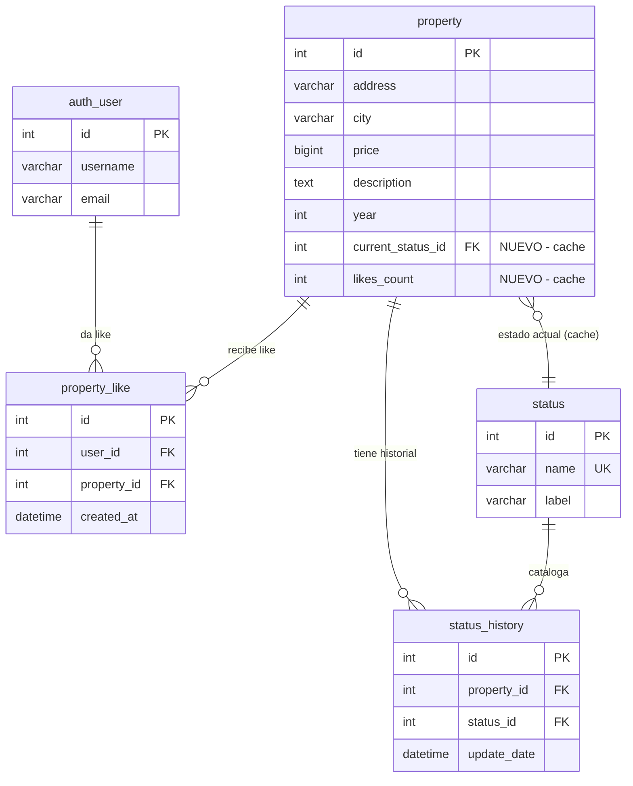

```mermaid
erDiagram
    auth_user ||--o{ property_like : "da like"
    property  ||--o{ property_like : "recibe like"
    property  ||--o{ status_history : "tiene historial"
    property  }o--|| status : "estado actual (cache)"
    status    ||--o{ status_history : "cataloga"

    auth_user {
        int id PK
        varchar username
        varchar email
    }

    property {
        int id PK
        varchar address
        varchar city
        bigint price
        text description
        int year
        int current_status_id FK "NUEVO - cache"
        int likes_count "NUEVO - cache"
    }

    status {
        int id PK
        varchar name UK
        varchar label
    }

    status_history {
        int id PK
        int property_id FK
        int status_id FK
        datetime update_date
    }

    property_like {
        int id PK
        int user_id FK
        int property_id FK
        datetime created_at
    }
```
